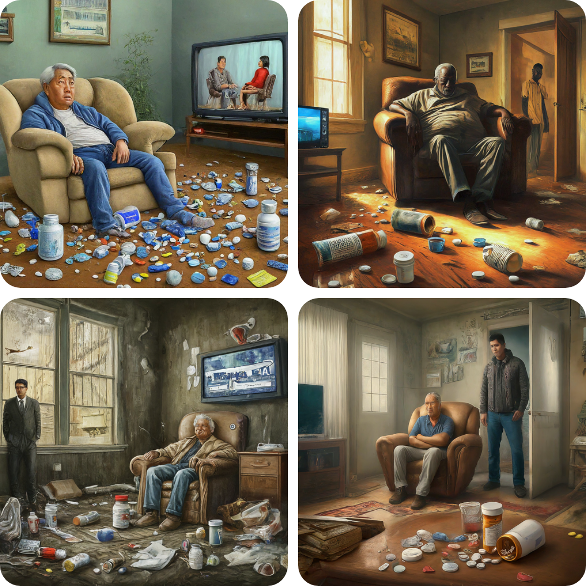
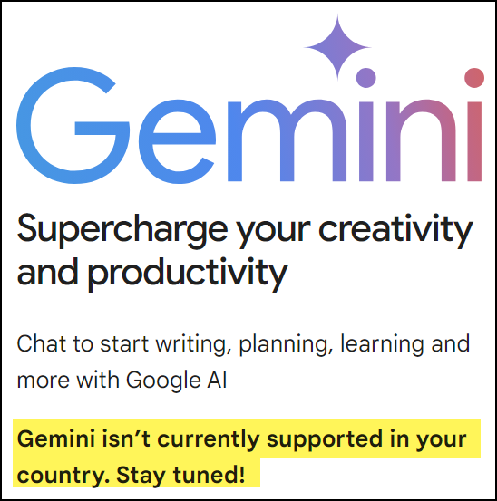

# README

## February 2024

### Google Wokeness

Gemini is going through a period where it refuses to create images of Caucasian people ([Google News](https://news.google.com/search?q=google%20gemini%20woke%20February%202024&hl=en-US&gl=US&ceid=US%3Aen)) ([Youtube](https://www.youtube.com/watch?v=5R89vqYr3_M)). 

Witness this image, created from the prompt "*Create an illustrated image depicting a cluttered living room scene with two characters and a television. In the foreground, there's an overflowing amount of discarded pill bottles and caps, suggesting a problem with medication misuse. Central in the image is an older man with grey hair and a beard, appearing disheveled and weary, sitting in a beige recliner. He's wearing a blue sweatshirt, white undershirt, and blue jeans, with his hands resting in his lap. On the television, a male and female news anchor are visible. The blue and white color palette of the TV screen contrasts with the warm interior lighting. On the left, standing in the doorway with his arms crossed, is a younger man wearing a white t-shirt and grey sweatpants, observing the older man with a concerned expression. The room is in disarray, with papers, boxes, and trash scattered throughout. The walls are a muted teal with a crack and a torn poster, adding to the sense of neglect and despair. Overall, the image conveys a strong message about the impact of media and medication on mental health.*" If anything, Google is worsening the bias it is trying to overcome by making all these "junkies" anything but Caucasian.

  

### Still Blocked in Canada

Previously Google Bard was blocked in Canada but when Google realized it was falling drastically behind in the AI wars it released to the tether and gave us Gemini upon its release. I immediately signed up but kept running into issues where it was still telling me it wasn't available here.

  

