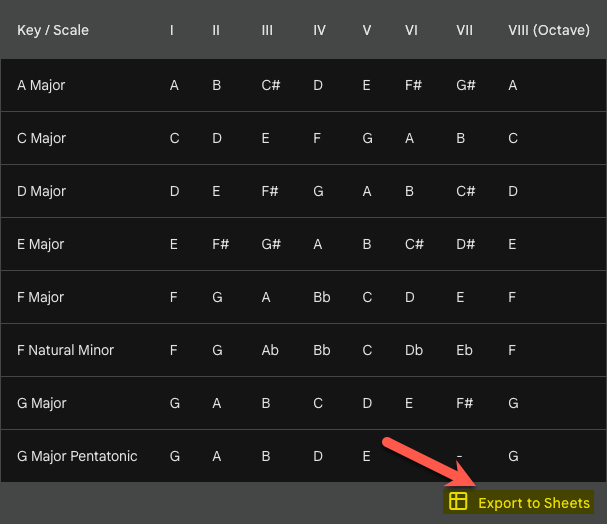

# Gemini 

This folder only contains projects where I had some surpising successes or learned some things. Mundane things are not included.

## Export to Google Sheets (Nice!)

It's nice to see this new feature. It will definitely come in handy for many projects! (It is these kinds of features which will differentiate Gemini from ChatGPT Plus.)

  

## Bass Guitar Fretboard Using Python

This little project went surprisingly well.

My long-term goal is to write (with help) a program that can help me learn where the notes are on a bass guitar fretboard. This portion is phase 1. Later on, I will superimpose the finger position and the name of the note in the correct positions, then animate a series of these into scales or songs.

These were the prompts that I used:

1) Write a Python program that uses the Arcade library to draw a bass guitar fretboard up to the 12th fret.
2) Make it a little larger.
3) Make the window more rectangular, with a similar h/w ratio as the fretboard.
4) Make it a little taller to accommodate text later on.
5) After the window is created, save the window as "bass-guitar-fretboard.png" in the same folder as the file. The CWD is not the same location as the file.

And voilà, it worked!

  

